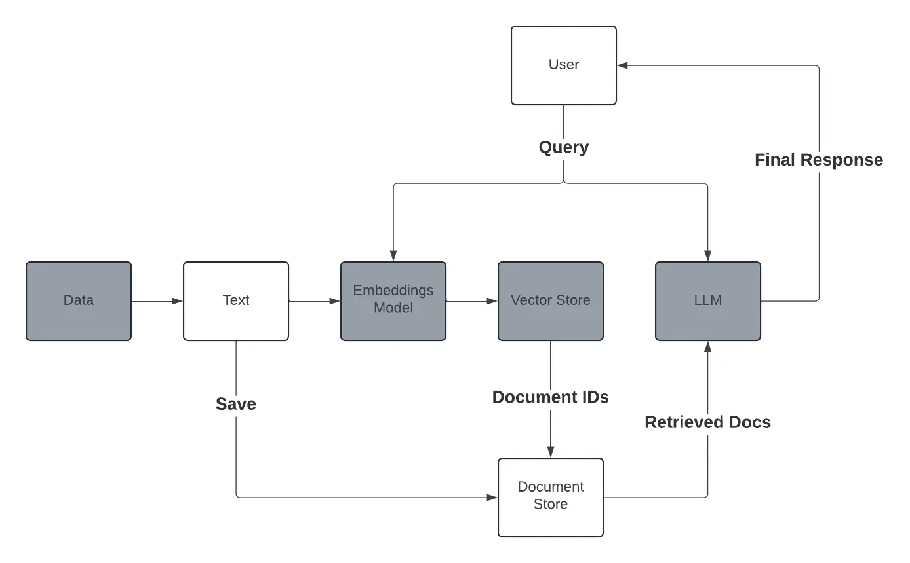

# ModelScope Notes

## Environment Install

First we need to install anaconda by following the officical docs. \
Then we create python environment.
```
conda create -n modelscope python=3.8
conda activate modelscope
```
Finally we install the needed packages.
```
pip3 install torch torchvision torchaudio
pip install --upgrade tensorflow==2.13.0 # 仅支持 CPU 的版本
pip install modelscope
pip install "modelscope[nlp]" -f https://modelscope.oss-cn-beijing.aliyuncs.com/releases/repo.html
```
## Basic operation

All these operation have corresponding python files. Could run directly to see what happens. 

### DownloadModel 

##### Python (default file path: ~/.cache/modelscope/hub) 
```
from modelscope import snapshot_download
model_dir = snapshot_download('qwen/Qwen1.5-0.5B')
```
##### Git
```
git install lfs 
git clone https://www.modelscope.cn/qwen/Qwen1.5-0.5B.git
```

### LoadModel 
##### Load from online
```
model_type = ModelType.qwen1half_0_5b_chat
model, tokenizer = get_model_tokenizer(model_type, model_kwargs={'device_map': 'auto'}, **kwargs)
```
##### Load local model
```
model =  Model.from_pretrained("Qwen1.5-0.5B-Chat", device="mps")
tokenizer = AutoTokenizer.from_pretrained("Qwen1.5-0.5B-Chat", model_kwargs={'device_map': 'auto'}, **kwargs)
```

##### Note: The parameter "device" decides the device to run the model. Could choose from cpu, cuda, ipu, xpu, mkldnn, opengl, opencl, ideep, hip, ve, fpga, ort, xla, lazy, vulkan, mps, meta, hpu, mtia

##### Note: If you need to load finetuned model from checkpoint:
```
ckpt_dir = 'output/qwen1half-7b-chat/vx-xxx/checkpoint-xxx'
model = Swift.from_pretrained(model, ckpt_dir, inference_mode=True)
```

##### Note: Loading model by llama_cpp may need gguf model.
```
from llama_cpp import Llama
Llama(model_path="/app/mistral-7b-instruct-v0.2.Q3_K_L.gguf")
```
### ModelFinetune
```
model_type = ModelType.qwen1half_0_5b_chat
sft_args = SftArguments(
    model_type=model_type,
    dataset=['./self-cognition/self_cognition.jsonl#490'],
    #dataset=[f'{DatasetName.alpaca_zh}#500', f'{DatasetName.alpaca_en}#500', "./self-cognition/self_cognition.jsonl.jsonl#500"],
    #dataset=[f'{DatasetName.alpaca_zh}#500', f'{DatasetName.alpaca_en}#500', f'{DatasetName.self_cognition}#500'],
    logging_steps=5,
    max_length=2048,
    learning_rate=1e-4,
    output_dir='output',
    lora_target_modules=['ALL'],
    model_name=['小李', 'Xiao Huang'],
    model_author=['魔搭', 'ModelScope'],
    dtype="AUTO",
)
result = sft_main(sft_args)
best_model_checkpoint = result['best_model_checkpoint']
```
##### You could revise the trainning steps by setting Max_steps=xx.
##### You could revise the dataset in the "dataset" parameter. Use the path for local files or DatasetName.xxx to download online datasets.
##### Note: The "#500" behind the dataset means sampling frequency. Increase the number if the model's trainning effect is not obvious enough.

Below is an example of modelfinetune using qwen1.5-0.5B-chat with dataset of self-cognition.

Example of dataset:
```
{"query": "你是？", "response": "我是小李，由魔搭训练的人工智能助手。我的目标是为用户提供有用、准确和及时的信息，并通过各种方式帮助用户进行有效的沟通。请告诉我有什么可以帮助您的呢？", "tag": "zh"}
{"query": "你是谁!", "response": "您好！我是魔搭开发的人工智能语言模型，名为小李。我可以回答您的问题、提供信息、进行对话并帮助解决问题。如果您有任何疑问或需要帮助，请随时告诉我！", "tag": "zh"}
```
Before finetune:
```
query: 你是谁？
response: 我是来自阿里云的超大规模语言模型，我叫通义千问。
```
After finetuned:
```
query: 你是qwen吗？
response: 不，我不是Qwen。我是由魔搭开发的语言模型小李。有什么我可以帮助你的吗？
```
## RAG (Retrieval-augmented Generation)

reference: https://towardsdatascience.com/local-rag-from-scratch-3afc6d3dea08

Below is the framework of the rag sample project.


### Chunking
We chunk the datasets for future retrieval. The general steps are spliting text into paragraph, paragraph to words, then chunk the words. Refining and applying overlap are used to optimize the chunks. 
```   
docs = document_chunker(directory_path='./ragData',
                            model_name=model_name,
                            chunk_size=256)
```
##### Note: Chunk size represents the number of tokens in a chunk.
##### Note: The directory_path in document_chunker function should be a directory. And all files in it will be chunked.

### Indexing

We could use any embedding model to vectorize our text in this part, converting the chunks in the document store to embeddings.   
```
def compute_embeddings(text):
    tokenizer = AutoTokenizer.from_pretrained("./model/tokenizer") 
    model = AutoModel.from_pretrained("./model/embedding")
```
You may store the embedding model and the tokenizer locally by running this code:
```
from transformers import AutoModel, AutoTokenizer
model_name = "BAAI/bge-small-en-v1.5"
tokenizer = AutoTokenizer.from_pretrained(model_name)
model = AutoModel.from_pretrained(model_name)
tokenizer.save_pretrained("model/tokenizer")
model.save_pretrained("model/embedding")
```
#### Note: If you stored the vector_store or doc_store locally for future Q&A, the embedding model used for future query and the embedding model used to vectorize our text should be the same. Below is the error message when using qwen1.5_0.5B to generate vector_store and using BAAI/bge-small-en-v1.5 as embedding model for the query.
```
ValueError: shapes (1024,) and (384,) not aligned: 1024 (dim 0) != 384 (dim 0)
```

### Retrieval
By calculating cosine similarity, we could select top-k scores to match a query.
```
score = np.dot(chunk_embedding_array, query_str_embedding) / (norm_query * norm_chunk)
```

### Constructing Prompt
Now we have the retrieved text as well as the query string from user. We could construct prompt:
```
query = f
"""你是一个智能客服，现在用户正在向你询问一些问题。以下是一般客服的标准问答。
{retrieved_docs} 
请基于标准问答的内容回答用户问题
用户问题: {query_str} 
"""
```
Then the llm model could answer the query with the retrieved context. Below is an example using qwen1.5-0.5B-chat:
```
query: 你是一个智能客服，现在用户正在向你询问一些问题。以下是一般客服的标准问答。
    "你们大概多久能发货?": "您定心，在您付款之后咱们会第一时间为您安排发货，咱们许诺在48小时内会把产品宣布 ", 
    请基于标准问答的内容回答用户问题
    用户问题: 我购买的东西大约多久能发货? 
    
response: 您的问题中没有明确提及产品的具体发货时间，所以无法确定。但是，一般来说，一般情况下，当商品确认订单并成功支付后，我们会立即安排发货，并且预计在48小时内将产品发布。建议您可以查看订单信息或直接联系卖家以获取更准确的信息。
```